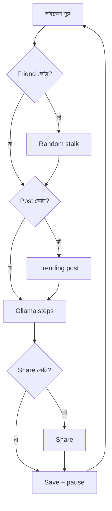

# Facebook Agent — সিস্টেম ডিজাইন গাইড (বাংলা)

এই ডকুমেন্টে পুরো প্রজেক্ট কীভাবে কাজ করে — আর্কিটেকচার, মডিউল, দৈনিক কোটা, এবং দুটি রান মোড — বিস্তারিত বর্ণনা করা হয়েছে।

---

## ১. উদ্দেশ্য

এজেন্ট একটি অ্যাকাউন্টে **মানুষের মতো ফেসবুক অ্যাক্টিভিটি** করে:

- নিউজফিড স্ক্রল, লাইক, কমেন্ট, শেয়ার
- ফিড থেকে ট্রেন্ডিং টপিক বুঝে মূল মতামতসহ স্ট্যাটাস পোস্ট
- দিনে ৩–৪ জনের বেশি নয় — শুধু ২০০০+ ফলোয়ার/ফ্রেন্ড আছে এমন প্রোফাইলে friend request
- ব্রাউজার সেশন ও দৈনিক কাউন্টার রিস্টার্টের পরেও সংরক্ষিত থাকে

মূল কমান্ড:

```bash
python scripts/run_agent_brain.py
```

---

## ২. উচ্চ-স্তরের আর্কিটেকচার

```
                    +-------------------------+
                    |  scripts/run_agent_brain |
                    |  (CLI, লগইন, লুপ)       |
                    +-----------+-------------+
                                |
              +-----------------+-----------------+
              v                 v                 v
     account_session      agent_executor      BaseBot
     (কুকি, লগইন)         (সাইকেল, কোটা)    (Playwright)
              |                 |                 |
              |     +-----------+-----------+     |
              |     v                       v     |
              |  agent_brain            actions <--+
              |  (JSON সিদ্ধান্ত)     (UI অটোমেশন)
              |     |
              |     v
              |  brain.py --> Ollama (llama3.1)
              |     |
              |     v
              +--> ai_comment.py --> Gemini (ঐচ্ছিক fallback)
```

### স্তর অনুযায়ী দায়িত্ব

| স্তর | মডিউল | কাজ |
|------|-------|-----|
| এন্ট্রি | `run_agent_brain.py` | আর্গুমেন্ট, ব্রাউজার চালু, অসীম লুপ |
| সেশন | `account_session.py` | `cookies.txt` পার্স, লগইন চেক |
| অর্কেস্ট্রেশন | `agent_executor.py` | দৈনিক কোটা, brain স্টেপ, structured সাইকেল |
| সিদ্ধান্ত | `agent_brain.py`, `brain.py` | Ollama-কে পরবর্তী JSON action জিজ্ঞাসা |
| কনটেন্ট | `ai_comment.py` | কমেন্ট, শেয়ার ক্যাপশন, স্ট্যাটাস |
| ব্রাউজার | `actions.py`, `bot_core.py` | ক্লিক, স্ক্রল, টাইপ |
| সোশ্যাল গ্রাফ | `facebook_graph.py` | ফ্রেন্ড সাজেশন, অডিয়েন্স চেক |
| স্টেলথ | `stealth_config.py`, `human_behavior.py` | ফিঙ্গারপ্রিন্ট, প্রাকৃতিক টাইপিং |

---

## ৩. রান মোড

### Brain mode (ডিফল্ট)

প্রতিটি **সাইকেল**:

1. **Friend phase** (কোটা বাকি): ১৫–২৫ র‍্যান্ডম row stalk, ১২–২৮ সেকেন্ড ব্রাউজ, অডিয়েন্স ≥ ২০০০ হলে request। **সাইকেলে ১**, **দিনে ৩–৪**।
2. **Status post phase**: ফিড স্ক্রল → মেমোরি → ট্রেন্ডিং টপিক → পোস্ট।
3. **Ollama steps** (ডিফল্ট ৮): observe → JSON → execute।
4. **Share top-up** — দৈনিক ২০ শেয়ার পূরণ।
5. বিরতি, আবার শুরু।

Ollama JSON উদাহরণ:

```json
{"action": "comment_post", "location": "newsfeed", "thought_process": "..."}
```

Ollama অফলাইন হলে offline fallback (স্ক্রল + সাধারণ লাইক/কমেন্ট)।

### Structured mode

নির্দিষ্ট ক্রম: friend → feed engagement (N রাউন্ড) → status post।

---

## ৪. দৈনিক কোটা

`profiles/<account_id>/` ফোল্ডারে:

| ফাইল | বিষয় |
|------|-------|
| `daily_friend_quota.json` | friend request (৩–৪/দিন) |
| `daily_post_quota.json` | স্ট্যাটাস (৩–৫/দিন) |
| `daily_share_quota.json` | শেয়ার (২০/দিন) |
| `storage_state.json` | ব্রাউজার সেশন |

---

## ৫. Friend request ফ্লো

1. Suggestions page খোলা
2. ৫ বার হালকা scroll
3. র‍্যান্ডম row ক্লিক (mobile-safe)
4. প্রোফাইল ১২–২৮ সেকেন্ড browse
5. friends/followers count (DOM + Ollama)
6. ≥ ২০০০ হলে Add Friend
7. দৈনিক সীমায় থামা

আলাদা চালান: `python scripts/send_one_friend.py`

---

## ৬. স্ট্যাটাস পোস্ট

1. ফিড স্ক্রল → snippet জমা
2. Ollama দিয়ে trending topic
3. মূল মতামত লেখা (generic বাক্য নয়)
4. composer-এ human-type করে publish

২টির কম snippet থাকলে skip।

---

## ৭. শেয়ার

1. ফিড পোস্ট বাছাই
2. Ollama/Gemini ক্যাপশন
3. human typing — typo, backspace, pause
4. confirm → ফিডে ফিরে যাওয়া

---

## ৮. AI স্ট্যাক

| কাজ | প্রাথমিক | Fallback |
|-----|----------|----------|
| পরবর্তী action | Ollama | Offline |
| কমেন্ট | Ollama | Gemini |
| ক্যাপশন | Ollama | Gemini |
| স্ট্যাটাস | Ollama | Skip |
| অডিয়েন্স | DOM | Ollama |

চেক: `python scripts/check_ollama.py`

---

## ৯. ব্রাউজার ও স্টেলথ

- অ্যাকাউন্টভিত্তিক persistent profile
- মোবাইল viewport ৩৬০×৮০০
- র‍্যান্ডম mobile UA
- playwright-stealth
- Bezier mouse, segment scroll, natural typing

---

## ১০. cookies.txt

প্রতি অ্যাকাউন্ট ৩ লাইন:

```
account_id
password
c_user=...; xs=...; datr=...
```

---

## ১১. মডিউল তালিকা

| ফাইল | বর্ণনা |
|------|--------|
| `account_session.py` | cookies, login |
| `agent_executor.py` | cycles, quotas |
| `agent_brain.py` | action JSON prompt |
| `brain.py` | Ollama client |
| `ai_comment.py` | text generation |
| `actions.py` | UI automation |
| `facebook_graph.py` | friend graph |
| `facebook_login.py` | login/checkpoint |
| `post_engagement.py` | feed posts |
| `profile_engagement.py` | profile stalk |
| `stealth_config.py` | anti-detection |
| `user_agent_rotation.py` | UA pool |

---

## ১২. সমস্যা সমাধান

| সমস্যা | সমাধান |
|--------|---------|
| Ollama unreachable | Ollama চালু; `.env`-এ port 11434 |
| Profile locked | Chromium বন্ধ করুন |
| ০ friend | Ollama + suggestions page চেক |
| স্ট্যাটাস নেই | আরো সাইকেল — memory বাড়তে হবে |
| Checkpoint | ম্যানুয়াল verify (৩০ মিনিট wait) |

---

## ১৩. Brain cycle


