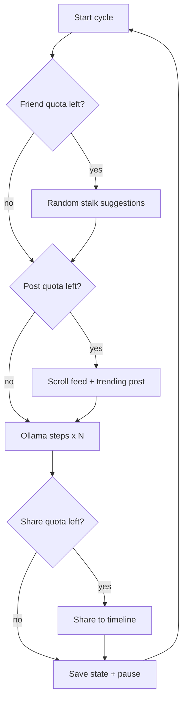

# Facebook Agent — System Design Guide (English)

This document explains how the project works end-to-end: architecture, modules, daily quotas, and the two run modes.

---

## 1. Purpose

The agent automates **human-like Facebook activity** for a single account at a time:

- Scroll and engage with the news feed (like, comment, share)
- Publish original status posts based on trending topics seen in the feed
- Send a small number of friend requests to high-audience profiles
- Persist browser session and daily counters across restarts

Main entry point:

```bash
python scripts/run_agent_brain.py
```

---

## 2. High-level architecture

```
                    +-------------------------+
                    |  scripts/run_agent_brain |
                    |  (CLI, login, loop)      |
                    +-----------+-------------+
                                |
              +-----------------+-----------------+
              v                 v                 v
     account_session      agent_executor      BaseBot
     (cookies, login)     (cycles, quotas)   (Playwright)
              |                 |                 |
              |     +-----------+-----------+     |
              |     v                       v     |
              |  agent_brain            actions <--+
              |  (JSON decisions)    (UI automation)
              |     |
              |     v
              |  brain.py --> Ollama (llama3.1)
              |     |
              |     v
              +--> ai_comment.py --> Gemini (optional fallback)
```

### Layer responsibilities

| Layer | Module(s) | Role |
|-------|-----------|------|
| Entry | `scripts/run_agent_brain.py` | Parse args, start browser, run infinite cycle loop |
| Session | `account_session.py` | Parse `cookies.txt`, detect login state |
| Orchestration | `agent_executor.py` | Daily quotas, brain steps, structured cycles |
| Decision | `agent_brain.py`, `brain.py` | Ask Ollama for next JSON action |
| Content | `ai_comment.py` | Comments, share captions, status posts |
| Browser | `actions.py`, `bot_core.py` | Playwright clicks, scroll, type |
| Social graph | `facebook_graph.py` | Friend suggestions, audience checks |
| Stealth | `stealth_config.py`, `human_behavior.py` | Fingerprint masking, natural typing |

---

## 3. Run modes

### Brain mode (default)

Each **cycle**:

1. **Friend phase** (if quota remains): open 15–25 random suggestion rows, stalk profiles 12–28s, send request if audience >= 2k. Max **1 send per cycle**, **3–4 per day**.
2. **Status post phase** (if quota remains): scroll feed, collect text snippets, infer trending topics, publish one post.
3. **Ollama steps** (`--steps-per-burst`, default 8): observe page → JSON action → execute.
4. **Share top-up** if daily share quota not met.
5. Pause 45–120s, repeat.

Ollama outputs structured JSON:

```json
{"action": "comment_post", "location": "newsfeed", "thought_process": "..."}
```

If Ollama is offline, the executor falls back to deterministic offline actions.

### Structured mode (`--mode structured`)

Fixed pipeline each cycle:

1. Friend send + accept (optional)
2. Feed rounds: scroll → like → comment → share
3. Status post

---

## 4. Daily quotas and persistence

Counters live in `profiles/<account_id>/`:

| File | Tracks |
|------|--------|
| `daily_friend_quota.json` | Friend requests sent / target (3–4) |
| `daily_post_quota.json` | Status posts / target (3–5) |
| `daily_share_quota.json` | Shares / target (20) |
| `storage_state.json` | Chromium cookies and local storage |

---

## 5. Friend request flow

`facebook_graph.py` → `run_daily_friend_send_phase()`:

1. Open friend suggestions
2. Light scroll (5 passes)
3. Click random suggestion row (mobile-safe)
4. Browse profile 12–28 seconds
5. Read friends/followers (DOM + Ollama if needed)
6. Send request if count >= 2000
7. Stop at daily cap

Utility (same logic): `python scripts/send_one_friend.py`

---

## 6. Status post flow

1. Scroll feed → store snippets in `feed_memory_snippets`
2. Infer trending topics via Ollama
3. Generate original opinion post
4. Publish via composer with human typing

Skipped if fewer than 2 feed snippets collected.

---

## 7. Share flow

1. Pick visible feed post (skip stories/reels)
2. Generate caption (Ollama / Gemini)
3. Human natural typing: delays, typos, backspace
4. Confirm share, return to feed

---

## 8. AI stack

| Task | Primary | Fallback |
|------|---------|----------|
| Next action | Ollama | Offline scroll/like |
| Comments | Ollama | Gemini API |
| Share captions | Ollama | Gemini API |
| Status posts | Ollama | Skip |
| Profile audience | DOM | Ollama text read |

Check Ollama: `python scripts/check_ollama.py`

---

## 9. Browser and stealth

- Persistent Chromium profile per account
- Mobile viewport 360x800 (default)
- Rotating mobile user agents
- playwright-stealth init scripts
- Bezier mouse, segment scroll, natural typing

---

## 10. cookies.txt format

Three lines per account:

```
account_id
password
c_user=...; xs=...; datr=...
```

---

## 11. Module reference

| File | Description |
|------|-------------|
| `account_session.py` | cookies.txt parsing, login detection |
| `agent_executor.py` | AgentSession, cycles, quotas, agent_step |
| `agent_brain.py` | Ollama action JSON prompt |
| `brain.py` | Ollama HTTP client |
| `ai_comment.py` | Comment/caption/post generation |
| `actions.py` | Playwright UI interactions |
| `facebook_graph.py` | Friend requests, audience resolution |
| `facebook_login.py` | Login, checkpoint detection |
| `post_engagement.py` | Feed post selection |
| `profile_engagement.py` | Profile stalk browsing |
| `stealth_config.py` | Anti-detection |
| `user_agent_rotation.py` | UA rotation |

---

## 12. Troubleshooting

| Problem | Fix |
|---------|-----|
| Ollama not reachable | Start Ollama; set OLLAMA_HOST=127.0.0.1:11434 |
| Profile locked | Close other Chromium windows |
| 0 friend sends | Check Ollama; verify suggestions page |
| No status posts | More cycles to build feed memory |
| Checkpoint | Complete manually; agent waits up to 30 min |

---

## 13. Brain cycle flow


